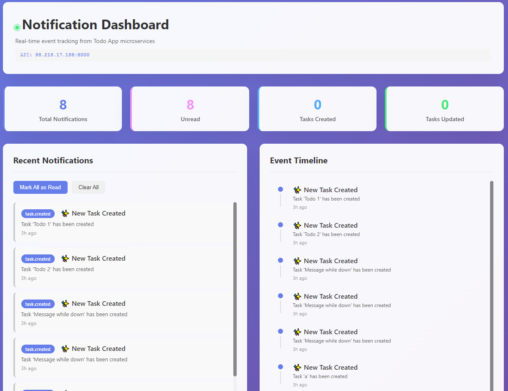

# Todo App - Microservices Architecture Demo




A complete **microservices demo** showcasing a Todo application with **event-driven architecture** using RabbitMQ and embedded real-time notification dashboard.

## 🏗️ Architecture Overview

```
┌─────────────────────────────────────────────────────────────────┐
│                                                                   │
│  ┌──────────────────────┐         ┌──────────────────────────┐  │
│  │   Todo App (5000)    │         │  Notification Service    │  │
│  │  ASP.NET Core 3.1    │         │     (8000)               │  │
│  │   + React UI         │         │   Python FastAPI         │  │
│  │                      │         │   + Dashboard UI         │  │
│  └──────────────────────┘         └──────────────────────────┘  │
│       │                │                │                │      │
│       ▼                ▼                ▼                ▼      │
│  ┌──────────────┐  ┌──────────────┐  ┌──────────────┐         │
│  │  MongoDB     │  │   RabbitMQ   │  │  MongoDB     │         │
│  │   (27017)    │  │ (5672/15672) │  │   (27017)    │         │
│  │ todos DB     │  │   Broker     │  │ notif DB     │         │
│  └──────────────┘  └──────────────┘  └──────────────┘         │
│                                                                   │
└─────────────────────────────────────────────────────────────────┘
```

## 📦 Services

| Service | Port | Technology | Purpose |
|---------|------|-----------|---------|
| **Todo App** | 5000 | ASP.NET Core 3.1 + React | Main application for creating/managing tasks |
| **Notification Service** | 8000 | Python FastAPI | Event processor with real-time dashboard UI |
| **RabbitMQ** | 5672 | Message Broker | Async event decoupling & messaging |
| **RabbitMQ Management** | 15672 | Admin UI | Message queue monitoring (guest/guest) |
| **MongoDB** | 27017 | Database | Stores todos and notification events |

## 🚀 Quick Start (2 minutes)

### Prerequisites
- Docker & Docker Compose installed
- 4GB RAM available
- Ports 5000, 5672, 8000, 15672, 27017 available

### Start Everything

```bash
# Navigate to project
cd dotnet-docker

# Start all services (builds automatically if needed)
docker-compose up --build -d

# Verify all services are running
docker-compose ps

# View logs
docker-compose logs -f
```

### Access Services

| Service | URL |
|---------|-----|
| Todo App | http://localhost:5000 |
| Notification Dashboard | http://localhost:8000 |
| RabbitMQ Management | http://localhost:15672 |

## 📝 Usage Examples

### 1. Create a Todo

```bash
curl -X POST http://localhost:5000/api/todos \
  -H "Content-Type: application/json" \
  -d '{"title":"Learn Microservices","description":"Master async event-driven architecture"}'
```

Response:
```json
{
  "id": "692c0dc0d1870900010a9c40",
  "title": "Learn Microservices",
  "description": "Master async event-driven architecture",
  "isCompleted": false
}
```

### 2. Get All Todos

```bash
curl http://localhost:5000/api/todos | jq .
```

### 3. Update a Todo

```bash
curl -X PUT http://localhost:5000/api/todos/{id} \
  -H "Content-Type: application/json" \
  -d '{"title":"Learn Microservices","description":"...","isCompleted":true}'
```

### 4. View Notifications

Open **http://localhost:8000** in your browser to see:
- Real-time notification updates
- Event statistics
- Timeline visualization
- Auto-refreshing every 3 seconds

### 5. Get Notification Statistics

```bash
curl http://localhost:8000/stats | jq .
```

Response:
```json
{
  "total": 5,
  "unread": 5,
  "by_type": {
    "created": 3,
    "updated": 2
  }
}
```

## 📊 Complete API Reference

### Todo App Endpoints

```
GET    /api/todos                    - Get all todos
GET    /api/todos/{id}               - Get single todo
POST   /api/todos                    - Create new todo
PUT    /api/todos/{id}               - Update todo
DELETE /api/todos/{id}               - Delete todo
GET    /health                       - Health check
```

### Notification Service Endpoints

```
GET    /                             - Notification dashboard UI
GET    /notifications                - Get all notifications
GET    /notifications/task/{taskId}  - Get task notifications
POST   /notifications/{id}/read      - Mark as read
POST   /notifications/read-all       - Mark all as read
DELETE /notifications/{id}           - Delete notification
GET    /stats                        - Get statistics
POST   /events/task                  - Receive task event
GET    /health                       - Health check
GET    /readiness                    - Readiness check
```

## 🔧 Configuration

### Environment Variables

All settings are in `docker-compose.yml`. Key variables:

**Todo App**:
```
ASPNETCORE_ENVIRONMENT=Production
TODO_APP_MongoSettings__ConnectionString=mongodb://mongodb:27017
TODO_APP_RabbitMQ__Host=rabbitmq
```

**Notification Service**:
```
RABBITMQ_HOST=rabbitmq
MONGODB_URI=mongodb://mongodb:27017
LOG_LEVEL=INFO
```

## 🐳 Docker Commands

```bash
# View all services
docker-compose ps

# View logs (all services)
docker-compose logs -f

# View specific service logs
docker-compose logs -f todo-app
docker-compose logs -f notification-service

# Stop services
docker-compose stop

# Start services
docker-compose start

# Remove everything (reset)
docker-compose down -v

# Rebuild specific service
docker-compose build todo-app
docker-compose up -d todo-app

# Access container shell
docker-compose exec todo-app bash
docker-compose exec notification-service sh
```

## 🧪 Complete Test Script

```bash
#!/bin/bash

echo "=== Creating Todos ==="
TASK1=$(curl -s -X POST http://localhost:5000/api/todos \
  -H "Content-Type: application/json" \
  -d '{"title":"Task 1","description":"First task"}' | jq -r '.id')

TASK2=$(curl -s -X POST http://localhost:5000/api/todos \
  -H "Content-Type: application/json" \
  -d '{"title":"Task 2","description":"Second task"}' | jq -r '.id')

echo "Created tasks: $TASK1, $TASK2"

echo -e "\n=== Getting All Todos ==="
curl -s http://localhost:5000/api/todos | jq .

echo -e "\n=== Checking Notification Stats ==="
curl -s http://localhost:8000/stats | jq .

echo -e "\n=== Listing All Notifications ==="
curl -s http://localhost:8000/notifications | jq .
```

Save as `test.sh`, run with `chmod +x test.sh && ./test.sh`

## 📈 Monitoring

### Health Checks

```bash
# Todo App
curl http://localhost:5000/health

# Notification Service
curl http://localhost:8000/health
curl http://localhost:8000/readiness
```

### Check Service Status

```bash
# All containers
docker-compose ps

# Specific service logs
docker-compose logs mongodb
docker-compose logs rabbitmq
```

## 🎯 Event Flow

1. User creates/updates todo via **Todo App** (port 5000)
2. **Todo App** stores in MongoDB
3. **Event published** to RabbitMQ
4. **Notification Service** consumes event from queue
5. **Notification saved** to MongoDB
6. **Dashboard updates** automatically every 3 seconds
7. User sees real-time notifications at **Notification Service** (port 8000)

## 🚀 Kubernetes Deployment

### Prerequisites
- Kubernetes cluster
- Helm 3+ installed

### Deploy with Helm

```bash
# Create namespace
kubectl create namespace microservices

# Deploy
helm install todo-app ./helm-charts/app \
  -n microservices --create-namespace

# Verify
kubectl get pods -n microservices
kubectl get svc -n microservices
```

### Access Services

```bash
# Port forward Todo App
kubectl port-forward svc/todo-app 5000:5000 -n microservices &

# Port forward Notification Service
kubectl port-forward svc/notification-service 8000:8000 -n microservices &

# Check logs
kubectl logs -f deployment/todo-app -n microservices
kubectl logs -f deployment/notification-service -n microservices
```

## 🛠️ Troubleshooting

### Port Already in Use

```bash
# Find process using port
lsof -i :5000
lsof -i :8000

# Kill process
kill -9 <PID>
```

### Services Not Starting

```bash
# Check logs
docker-compose logs

# Rebuild everything
docker-compose down -v
docker-compose up --build -d
```

### No Notifications Appearing

1. Check notification service logs: `docker-compose logs notification-service`
2. Check RabbitMQ is healthy: `docker-compose logs rabbitmq`
3. Verify Todo App is sending events
4. Check MongoDB has notification database

### MongoDB Connection Issues

```bash
# Check MongoDB
docker-compose logs mongodb

# Restart MongoDB
docker-compose restart mongodb
```

### RabbitMQ Issues

```bash
# Check status
docker-compose logs rabbitmq

# Access management UI
http://localhost:15672
# Login: guest/guest
```

## 📚 Project Structure

```
dotnet-docker/
├── TodoApp/                           # ASP.NET Core 3.1 App
│   ├── Dockerfile                     # Multi-stage build
│   ├── ClientApp/                     # React frontend
│   ├── Controllers/TodoController.cs  # API endpoints
│   ├── Models/                        # Data models
│   └── Startup.cs                     # Configuration
├── notification-service/              # Python FastAPI App
│   ├── Dockerfile
│   ├── main.py                        # Application entry point
│   ├── models.py                      # Pydantic models
│   ├── db.py                          # MongoDB client
│   ├── rabbitmq_client.py             # RabbitMQ client
│   ├── static/
│   │   └── index.html                 # Dashboard UI
│   └── requirements.txt                # Python dependencies
├── helm-charts/app/                   # Kubernetes Helm chart
│   ├── Chart.yaml
│   ├── values.yaml                    # Configuration values
│   └── templates/                     # Kubernetes manifests
├── docker-compose.yml                 # Docker multi-container setup
└── README.md                          # This file
```

## 🔐 Security Notes

This is a **demonstration application**. For production:

- [ ] Use strong credentials (not guest/guest)
- [ ] Enable MongoDB authentication
- [ ] Use HTTPS/TLS
- [ ] Implement API authentication (JWT, OAuth2)
- [ ] Add request validation
- [ ] Use Kubernetes Secrets for sensitive data
- [ ] Enable network policies
- [ ] Set resource limits
- [ ] Use private container registries
- [ ] Add comprehensive logging

## 📦 Key Technologies

| Component | Technology | Version |
|-----------|-----------|---------|
| Backend API | ASP.NET Core | 3.1 |
| Frontend | React | 16+ |
| Message Broker | RabbitMQ | 3.13 |
| Database | MongoDB | 7.0 |
| Container Runtime | Docker | 20.10+ |
| Orchestration | Docker Compose | 1.29+ |
| Kubernetes | kubectl | 1.20+ |
| Package Manager | Helm | 3+ |

## 📝 Notes

- **Demo App**: No persistent storage in Kubernetes (ephemeral volumes)
- **Event-Driven**: RabbitMQ decouples services
- **Real-time**: Dashboard auto-refreshes every 3 seconds
- **Embedded UI**: Dashboard served from notification service itself
- **Multi-platform**: Works on Docker, Docker Compose, and Kubernetes

## 📞 Support

Having issues?

1. Check service status: `docker-compose ps`
2. View logs: `docker-compose logs`
3. Test endpoints: Use curl commands above
4. Verify ports are available: `lsof -i :5000`

## 📄 License

Demo project for educational purposes.

---

**Happy microservicing! 🚀**
